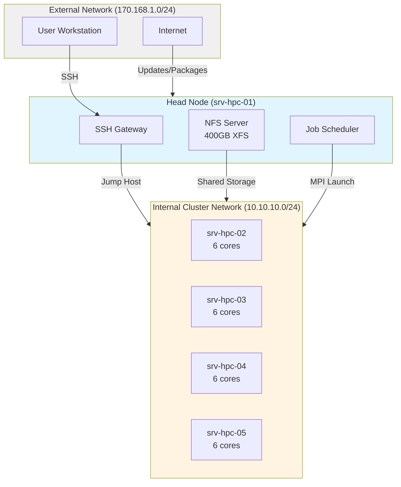
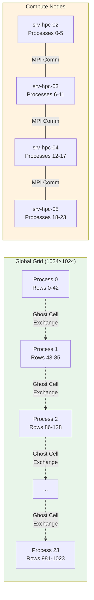
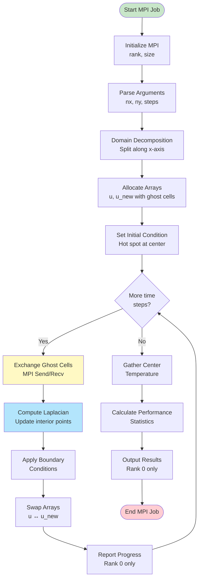
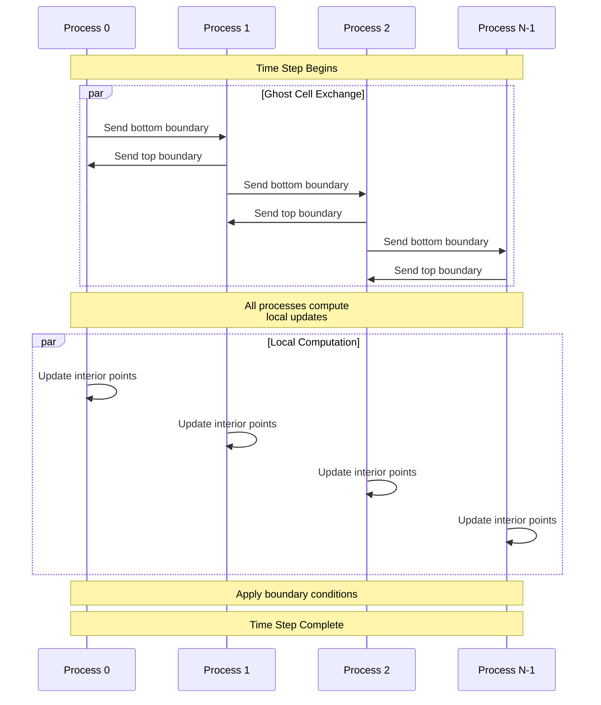
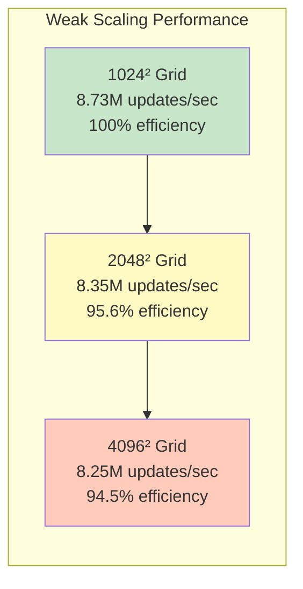
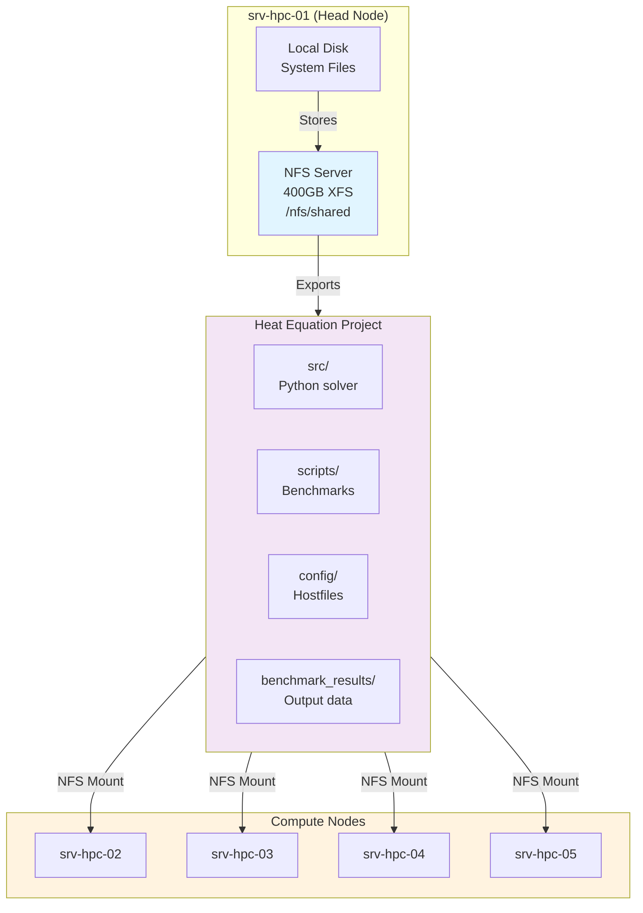
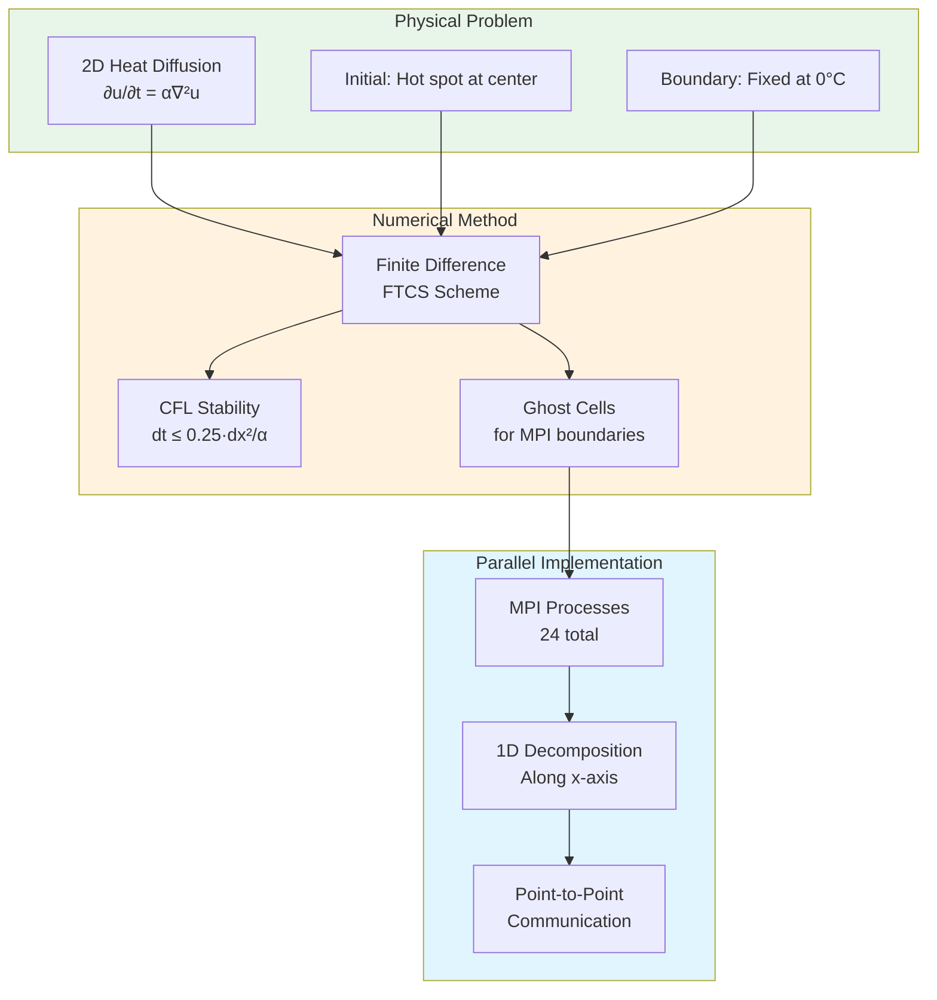
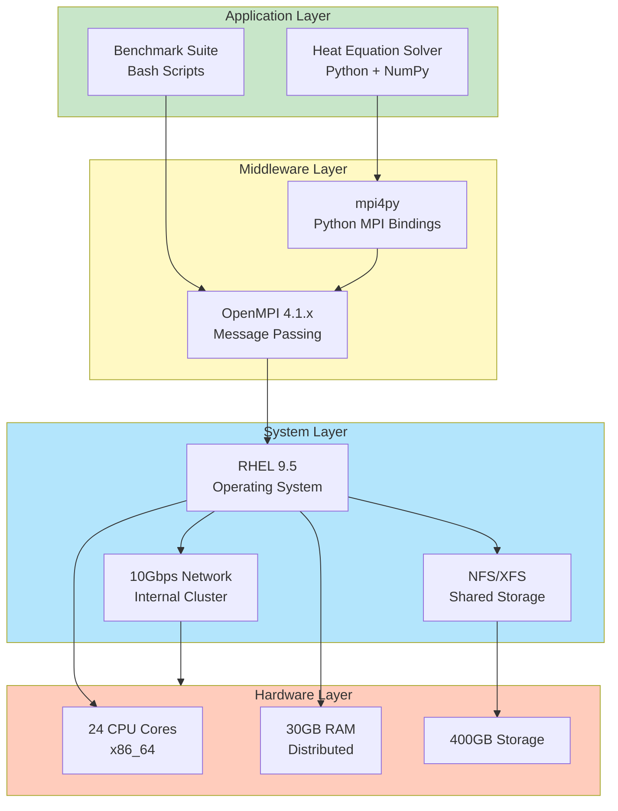

# HPC Cluster Architecture

This document provides visual diagrams of the cluster architecture and solver workflow.

## Network Topology

## MPI Domain Decomposition

## Solver Workflow

## Data Flow Between Processes

## Performance Scaling

## Storage Architecture

## Heat Equation Visualization

## Technology Stack

---

These diagrams provide a comprehensive visual overview of the HPC cluster architecture, data flow, and solver implementation. For interactive versions, paste the Mermaid code into [Mermaid Live Editor](https://mermaid.live/).
